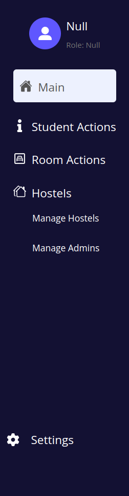
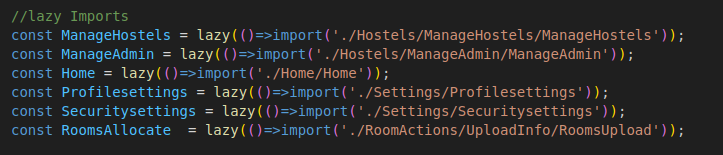
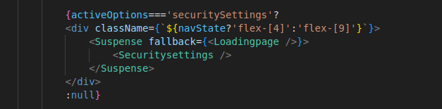

# Make New Page

Making a new page is easy task, here we are not using react router dom for making new pages. instead we are making use of mounting and unmounting components of page on the main dashboard page using react redux and react suspense.

<!--  -->

export const Image = ({children,width}) => (

  

    {children}
  

  

);

<Image width="100px"></Image>

In this image as you can see there are Options and Sub Options so we need to manage both the states.

### STEP #1

we will make a page inside suitable folder with .jsx

### STEP #2

we will then import it to the main dashboard page using lazy import 

##### Dashboard.jsx
<Image width="500px"></Image>

let's say we are making Security Settings page. after importing into dashboard page we will make use of react suspense 

<Image width="500px"></Image>

here if the activeOption is not securitySettings then the page is set to false and hence you will not see it into dashboard.
what suspense will do is that it will not import the component until it is mouted saving the loading time and resourses.

### STEP #3 

Place it into sidebar and make routing.

Here we will make use of React Redux to set Sub Active options

Learn React Redux make use of useSelector and useDispatch to change states and access those states in any pages

you will find there slices inside store folder.

you can dispatch the action inside SuperSidebar.jsx in this case and make use of state in Dashboard page of super admin in this case.

